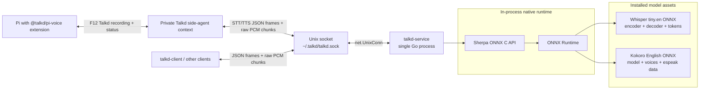

# talkd

A Bun/Turbo monorepo with a Dagger distribution workflow for local Talkd support in Pi:

- **Pi Talkd extension**: `packages/pi-voice`, a headless F12 spoken copilot for Pi
- **Voice service**: `talkd-service`, one long-running Go process for STT + TTS
- **STT**: Sherpa ONNX + Whisper ONNX
- **TTS**: Sherpa ONNX + Kokoro
- **IPC**: Unix domain socket with JSON frames + streamed raw PCM chunks

The service does **not** spawn inference subprocesses. STT and TTS run in-process through Sherpa's Go bindings. Audio device I/O may use small local subprocesses such as SoX `rec` and macOS `afplay`.

## Architecture



## Monorepo layout

```text
.
├── package.json              # Bun workspace root and local/Dagger workflow wrappers
├── dagger.json               # Dagger distribution workflow module
├── dagger/                   # Dagger Go pipeline implementation
├── turbo.json                # Local Turbo task graph
├── bun.lock                  # Bun lockfile
├── packages/
│   └── pi-voice/             # Pi package/extension for in-Pi voice mode
├── talkd-service/            # Go service workspace
│   ├── cmd/talkd-service/    # Unix socket service entrypoint
│   ├── cmd/talkd-client/     # small socket test client
│   └── internal/             # protocol/server/speech packages
└── scripts/
    ├── install-runtime.sh    # installs native libs + models to ~/.talkd
    └── install-binary.sh     # installs built service and patches rpath
```

## Prerequisites

- Bun `1.3+` for local workspace commands
- Go `1.22+` for local service commands
- Dagger `0.21+` plus a running Docker/compatible container engine for the distribution workflow
- `curl`, `tar`
- `ffmpeg` only for converting test audio files

## Install dependencies

```bash
bun install
```

## Install native runtime and models

```bash
bun run install:runtime
```

This installs platform-specific Sherpa/ONNX libraries plus model assets:

```text
~/.talkd/lib/libsherpa-onnx-c-api.{dylib,so}
~/.talkd/lib/libonnxruntime.{dylib,so*}
~/.talkd/models/stt/sherpa-onnx-whisper-tiny.en/
~/.talkd/models/tts/kokoro-en-v0_19/
```

The runtime installer supports macOS arm64/x64 and Linux x64/arm64. Native Windows is not currently supported by the Unix-socket setup path.

## Distribution workflow with Dagger

The source distribution gate is implemented as a Dagger module in `dagger/`. It runs the Pi TypeScript checks/build, the Go service checks/tests/build in Linux containers, and static distribution validation for stale files/references. GitHub Actions runs the same gate from `.github/workflows/ci.yml` on `ubuntu-latest`, assuming the standard GitHub-hosted Docker daemon is available for Dagger.

```bash
# full gate: check, build, test, distribution validation
bun run ci

# individual Dagger stages
bun run dagger:check
bun run dagger:build
bun run dagger:test
bun run dagger:validate
```

Export Linux service/client binaries from the Dagger build when needed:

```bash
dagger call service-binaries --source=. export --path ./dist/service
```

Local Turbo commands remain available for fast development when you do not need containerized validation:

```bash
bun run check
bun run build
bun run test
```

Turbo local build runs:

```text
@talkd/service build
@talkd/pi-voice build
```

## Use as a Pi plugin

```bash
bun install
bun --cwd packages/pi-voice run setup:runtime
bun run build

# Try once
pi -e ./packages/pi-voice/src/index.ts

# Or install project-local
pi install -l ./packages/pi-voice
```

Installing `@talkd/pi-voice` runs a best-effort setup step that downloads native runtime libraries and STT/TTS model assets, builds `talkd-service` when the Go source is available, and installs the service binary under `~/.talkd/bin`. Set `TALKD_PI_VOICE_SKIP_SETUP=1` to skip that install-time setup.

Inside Pi:

```text
F12 down  start recording
F12 up    send after Talkd infers release from stopped key repeats
F12 again fallback: stop recording and send
F12 while speaking/thinking: interrupt and start recording
```

Fallback shortcut:

```text
Ctrl+Shift+V
```

No panel is shown; Pi only shows a compact footer/status indicator. Talkd does not continuously listen in the background: the microphone is off in the ready/done states, and only `[REC] Talkd: recording active` records audio. Pi's current terminal shortcut API exposes key presses, not direct key-release events, so Talkd ignores F12 auto-repeat while recording and infers release when repeats stop. If a terminal does not provide usable repeats, pressing F12 again is the fallback send action. When a Pi session starts, the extension ensures `talkd-service` is available in the background: it reuses an existing socket service if present and starts the installed/local service otherwise without blocking the active Pi UI. Detailed transcript/timing/playback debug output is hidden by default and can be sent to a file with `TALKD_VOICE_DEBUG=1`.

Your speech goes to a separate lightweight Talkd side-agent context. Talkd uses the current harness snapshot and coordination tools for main Pi context, then activates its own side-agent skill, side-agent instructions/state, and the persisted recent Talkd conversation and decisions for recency. The copilot is read-only/coordination-only: it watches the visible/main harness session, talks with you about what is happening, can proactively respond when useful, and only sends instructions into the main harness when there is actionable work to do. It does not receive direct file editing, writing, shell, or coding tools. By default only Talkd's small recent state is persisted at `~/.pi/agent/talkd-voice-state.json`; `TALKD_VOICE_SESSION_DIR` is optional for persisting Talkd's own lightweight side-agent session. The runtime side-agent skill lives at `packages/pi-voice/side-agent-skills/talkd-side-agent-voice-copilot/SKILL.md`; the package also provides `/skill:talkd-voice-copilot` as reusable maintainer guidance for Talkd behavior and latency work. See `packages/pi-voice/README.md` for the full side-agent architecture.

## Start the service manually

The Pi extension auto-starts or reuses `talkd-service` when needed. To start the service manually instead:

```bash
bun run service
```

The service listens on:

```text
~/.talkd/talkd.sock
```

## Voice extension behavior

The Pi extension provides explicit Talkd recording controls:

```text
press and hold F12
  → start recording
release F12
  → Talkd infers release from stopped key repeats and stops recording
press F12 again
  → fallback stop recording
  → stream PCM to talkd STT
  → send transcript to a private Talkd side-agent context
  → optionally send actionable instructions to the main Pi harness
  → stream the copilot's spoken reply to talkd TTS
  → play the generated audio
press F12 while speaking/thinking
  → interrupt playback/agent
  → start recording again
```

Defaults:

- recording uses `rec` from SoX only while a Talkd recording turn is active:
  ```bash
  rec -q -t raw -b 16 -e signed-integer -c 1 -r 16000 -
  ```
- active recording is capped by `TALKD_PUSH_TO_TALK_MAX_MS` to avoid accidental open-mic recording
- playback uses macOS `afplay`; on Linux set `TALKD_PLAY_CMD`, for example `aplay {file}` or `paplay {file}`
- the service socket is `~/.talkd/talkd.sock`

Override commands and debug settings:

```bash
# custom microphone capture command; must write raw pcm16le mono 16k to stdout.
# Runs only during active Talkd recording.
export TALKD_RECORD_CMD='rec -q -t raw -b 16 -e signed-integer -c 1 -r 16000 -'

# recording safety cap; prevents accidental open-mic recording
export TALKD_PUSH_TO_TALK_MAX_MS=120000

# max gap between terminal key-repeat events while inferring F12 release
export TALKD_RECORDING_KEY_REPEAT_GAP_MS=900

# custom playback command. {file} is replaced with generated wav path
export TALKD_PLAY_CMD='afplay {file}'

# install location for runtime assets and the default service binary
export TALKD_HOME="$HOME/.talkd"

# persisted Talkd recent state; main Pi context is provided by snapshot/tools
export TALKD_VOICE_STATE_PATH="$HOME/.pi/agent/talkd-voice-state.json"
export TALKD_VOICE_RECENT_TURNS=16
export TALKD_VOICE_RECENT_DECISIONS=20

# optional: persist Talkd's own lightweight side-agent session
# export TALKD_VOICE_SESSION_DIR="$HOME/.pi/agent/sessions/talkd-voice"

# incremental speech synthesis chunking
export TALKD_STREAMING_TTS_MIN_CHARS=110
export TALKD_STREAMING_TTS_MIN_WORDS=16
export TALKD_STREAMING_TTS_CHUNK_CHARS=280

# Pi package debug logging, written to a file instead of over the active Pi display
export TALKD_VOICE_DEBUG=1
export TALKD_VOICE_DEBUG_LOG=/tmp/talkd-pi-voice-debug.log

# Optional Pi debug widget; off by default to keep the active UI unobstructed
export TALKD_VOICE_DEBUG_UI=1
```

## Socket protocol

Control frames are newline-delimited JSON. Binary payloads immediately follow the frame when `bytes` is present.

### TTS

```text
client -> service: {"type":"tts","text":"hello"}\n
service -> client: {"type":"tts_start","sample_rate":24000,"channels":1,"format":"pcm_s16le"}\n
service -> client: {"type":"audio","bytes":N}\n
<raw PCM16LE bytes>
service -> client: {"type":"tts_end"}\n
```

### STT

```text
client -> service: {"type":"stt_start","sample_rate":16000,"channels":1,"format":"pcm_s16le"}\n
client -> service: {"type":"audio","bytes":N}\n
<raw PCM16LE bytes>
client -> service: {"type":"stt_end"}\n
service -> client: {"type":"stt_final","text":"recognized text"}\n
```

Current STT accepts streamed audio chunks but uses an offline Whisper model, so it returns the final transcript after `stt_end`. TTS streams audio chunks while generation is running.

## Test the service with the CLI client

TTS:

```bash
cd talkd-service
./bin/talkd-client \
  -mode tts \
  -text "Hello from the local socket service." \
  -out /tmp/talkd-tts.pcm

ffmpeg -y -f s16le -ar 24000 -ac 1 -i /tmp/talkd-tts.pcm /tmp/talkd-tts.wav
afplay /tmp/talkd-tts.wav
```

STT:

```bash
ffmpeg -y -i /tmp/talkd-tts.wav -ar 16000 -ac 1 -f s16le /tmp/talkd-stt.pcm

cd talkd-service
./bin/talkd-client -mode stt -in /tmp/talkd-stt.pcm -sample-rate 16000
```

## Install service binary

After building, install and patch runtime library lookup:

```bash
./scripts/install-binary.sh talkd-service/bin/talkd-service talkd-service
```

Run installed service:

```bash
~/.talkd/bin/talkd-service
```

## Useful commands

```bash
bun run ci             # Dagger distribution gate
bun run dagger:check   # Dagger checks only
bun run dagger:build   # Dagger builds only
bun run dagger:test    # Dagger tests only
bun run dagger:validate # Dagger distribution validation only
bun run check          # Local Turbo check: Go tests + TypeScript check
bun run build          # Local build of all workspaces
bun run service        # Run Go socket service locally
```

## Notes

- Native libraries are dynamic and must be present before the service starts.
- `scripts/install-runtime.sh` prepares those libraries and models.
- `@talkd/pi-voice` install-time setup is idempotent and can be skipped with `TALKD_PI_VOICE_SKIP_SETUP=1`.
- `talkd-service` is shared and reused across Pi sessions.
- For true partial STT, replace the offline Whisper model with a Sherpa streaming ASR model.
