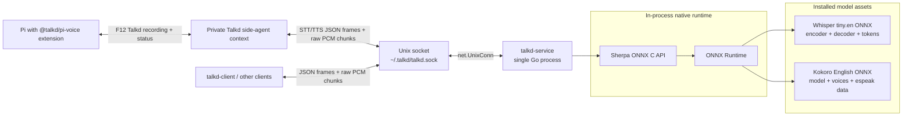

# talkd

A Bun/Turbo monorepo with a Dagger distribution workflow for local Talkd support in Pi:

- **Pi Talkd extension**: `packages/pi-voice`, a headless F12 spoken copilot for Pi
- **Voice service**: `talkd-service`, one long-running Go process for STT + TTS
- **STT**: Sherpa ONNX + Whisper ONNX
- **TTS**: Sherpa ONNX + Kokoro
- **IPC**: Unix domain socket with JSON frames + streamed raw PCM chunks

The service does **not** spawn inference subprocesses. STT and TTS run in-process through Sherpa's Go bindings. Audio device I/O may use small local subprocesses such as SoX `rec` and macOS `afplay`.

## Architecture



## Monorepo layout

```text
.
├── package.json              # Bun workspace root and local/Dagger workflow wrappers
├── dagger.json               # Dagger distribution workflow module
├── dagger/                   # Dagger Go pipeline implementation
├── turbo.json                # Local Turbo task graph
├── bun.lock                  # Bun lockfile
├── packages/
│   └── pi-voice/             # Pi package/extension for in-Pi voice mode
├── talkd-service/            # Go service workspace
│   ├── cmd/talkd-service/    # Unix socket service entrypoint
│   ├── cmd/talkd-client/     # small socket test client
│   └── internal/             # protocol/server/speech packages
└── scripts/
    ├── install.sh            # curl-friendly source/runtime/Pi installer
    ├── install-runtime.sh    # installs native libs + models to ~/.talkd
    └── install-binary.sh     # installs built service and patches rpath
```

## Prerequisites

- Bun `1.3+` for local workspace commands
- Go `1.22+` for local service commands
- Dagger `0.21+` plus a running Docker/compatible container engine for the distribution workflow
- `curl`, `tar`
- `ffmpeg` only for converting test audio files

## Install with one command

```bash
curl -fsSL https://raw.githubusercontent.com/kloudlite/talkd/main/scripts/install.sh | bash
```

Supports macOS arm64/x64 and Linux x64/arm64. The installer downloads a verified published service binary when available, otherwise falls back to a local Go build. Details and overrides live in `scripts/README.md`.

## Manual install

```bash
bun install
bun run install:runtime
```

This installs platform-specific Sherpa/ONNX libraries plus model assets:

```text
~/.talkd/lib/libsherpa-onnx-c-api.{dylib,so}
~/.talkd/lib/libonnxruntime.{dylib,so*}
~/.talkd/models/stt/sherpa-onnx-whisper-tiny.en/
~/.talkd/models/tts/kokoro-en-v0_19/
```

The runtime installer supports macOS arm64/x64 and Linux x64/arm64. Native Windows is not currently supported by the Unix-socket setup path.

## Distribution workflow with Dagger

The source distribution gate is implemented as a Dagger module in `dagger/`. It runs the Pi TypeScript checks/build, Go service checks, Linux service builds, and static distribution validation for stale files/references. GitHub Actions runs the same gate from `.github/workflows/ci.yml` on `ubuntu-latest`, assuming the standard GitHub-hosted Docker daemon is available for Dagger.

```bash
# gate: check, build, distribution validation
bun run ci

# individual Dagger stages
bun run dagger:check
bun run dagger:build
bun run dagger:test
bun run dagger:validate
```

Release builds are in `.github/workflows/release.yml`: manual dispatch builds downloadable artifacts only by default; publishing requires an existing explicit `v*` tag. Export Linux service/client binaries from Dagger when needed:

```bash
dagger call service-binaries --source=. export --path ./dist/service
```

Local Turbo commands remain available for fast development when you do not need containerized validation:

```bash
bun run check
bun run build
bun run test
```

Turbo local build runs:

```text
@talkd/service build
@talkd/pi-voice build
```

## Use as a Pi plugin

```bash
# one-command installer
curl -fsSL https://raw.githubusercontent.com/kloudlite/talkd/main/scripts/install.sh | bash

# or from a checkout
bun install
bun --cwd packages/pi-voice run setup:runtime
bun run build
pi install -l ./packages/pi-voice
```

Installing `@talkd/pi-voice` runs the same runtime setup; set `TALKD_PI_VOICE_SKIP_SETUP=1` to skip it.

Inside Pi, Talkd is explicit recording only: F12 starts recording, F12 release is inferred from stopped key repeats when available, and F12 again is the fallback send action. See `packages/pi-voice/README.md` for the detailed controls and knobs.

Talkd uses a lightweight, read-only side-agent with harness snapshots and coordination tools, not direct coding tools. See `packages/pi-voice/README.md` for the full side-agent architecture and runtime skill details.

## Start the service manually

The Pi extension auto-starts or reuses `talkd-service` when needed. To start the service manually instead:

```bash
bun run service
```

The service listens on:

```text
~/.talkd/talkd.sock
```

## Voice extension behavior

Talkd records only during an explicit user turn, sends speech to a lightweight read-only side-agent, and can pass actionable work back to the main Pi harness. Detailed F12 behavior, environment knobs, and side-agent notes live in `packages/pi-voice/README.md`.

## Socket protocol

Control frames are newline-delimited JSON. Binary payloads immediately follow the frame when `bytes` is present.

### TTS

```text
client -> service: {"type":"tts","text":"hello"}\n
service -> client: {"type":"tts_start","sample_rate":24000,"channels":1,"format":"pcm_s16le"}\n
service -> client: {"type":"audio","bytes":N}\n
<raw PCM16LE bytes>
service -> client: {"type":"tts_end"}\n
```

### STT

```text
client -> service: {"type":"stt_start","sample_rate":16000,"channels":1,"format":"pcm_s16le"}\n
client -> service: {"type":"audio","bytes":N}\n
<raw PCM16LE bytes>
client -> service: {"type":"stt_end"}\n
service -> client: {"type":"stt_final","text":"recognized text"}\n
```

Current STT accepts streamed audio chunks but uses an offline Whisper model, so it returns the final transcript after `stt_end`. TTS streams audio chunks while generation is running.

## Test the service with the CLI client

TTS:

```bash
cd talkd-service
./bin/talkd-client \
  -mode tts \
  -text "Hello from the local socket service." \
  -out /tmp/talkd-tts.pcm

ffmpeg -y -f s16le -ar 24000 -ac 1 -i /tmp/talkd-tts.pcm /tmp/talkd-tts.wav
afplay /tmp/talkd-tts.wav
```

STT:

```bash
ffmpeg -y -i /tmp/talkd-tts.wav -ar 16000 -ac 1 -f s16le /tmp/talkd-stt.pcm

cd talkd-service
./bin/talkd-client -mode stt -in /tmp/talkd-stt.pcm -sample-rate 16000
```

## Install service binary

After building, install and patch runtime library lookup:

```bash
./scripts/install-binary.sh talkd-service/bin/talkd-service talkd-service
```

Run installed service:

```bash
~/.talkd/bin/talkd-service
```

## Useful commands

```bash
bun run ci             # Dagger distribution gate
bun run dagger:check   # Dagger checks only
bun run dagger:build   # Dagger builds only
bun run dagger:test    # Dagger tests only
bun run dagger:validate # Dagger distribution validation only
bun run check          # Local Turbo check: Go tests + TypeScript check
bun run build          # Local build of all workspaces
bun run service        # Run Go socket service locally
```

## Notes

- Native libraries are dynamic and must be present before the service starts.
- `scripts/install-runtime.sh` prepares those libraries and models.
- `talkd-service` is shared and reused across Pi sessions.
- For true partial STT, replace the offline Whisper model with a Sherpa streaming ASR model.
